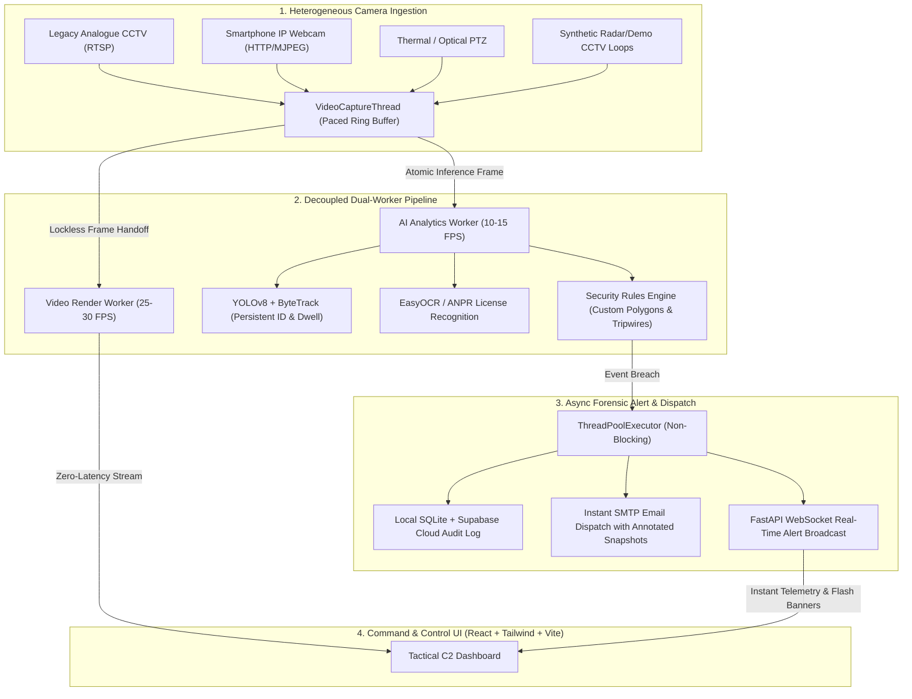

# 🛡️ IBVAP — Intelligent Border Video Analytics Platform
### *Smart India Hackathon (SIH) — Problem Statement SIH26187*
> **"AI-Based Intelligent Video Analytics Platform for Border Surveillance using existing CCTV Infrastructure"**

<div align="center">

[](https://sih.gov.in)
[](https://python.org)
[](https://fastapi.tiangolo.com)
[](https://github.com/ultralytics/ultralytics)
[](https://github.com/ifzhang/ByteTrack)
[](https://react.dev)
[](https://vitejs.dev)
[](https://tailwindcss.com)
[](LICENSE)

<br/>

**"We are not replacing the operator. We are reducing the video they need to watch."**

*A defense-grade, software-defined computer vision surveillance platform that retrofits legacy CCTV, RTSP network cameras, and field smartphones with real-time AI perimeter security analytics without requiring camera hardware replacement.*

</div>

---

## 📋 Table of Contents
1. [Executive Summary & Problem Statement SIH26187](#-executive-summary--problem-statement-sih26187)
2. [Key Technological Innovations](#-key-technological-innovations)
3. [System Architecture](#-system-architecture)
4. [Technology Stack](#-technology-stack)
5. [Directory Structure](#-directory-structure)
6. [Quick Start & Installation Guide](#-quick-start--installation-guide)
7. [Smartphone Field Prototyping](#-smartphone-field-prototyping)
8. [Interactive Multi-Zone Geo-Fencing](#-interactive-multi-zone-geo-fencing)
9. [Automated Email Forensic Alert Engine](#-automated-email-forensic-alert-engine)
10. [REST API & WebSocket Specifications](#-rest-api--websocket-specifications)
11. [Hardware Requirements & Benchmarks](#-hardware-requirements--benchmarks)
12. [Business Model & Market Viability](#-business-model--market-viability)
13. [Future Roadmap & TRL Status](#-future-roadmap--trl-status)
14. [License](#-license)

---

## 🎯 Executive Summary & Problem Statement SIH26187

### **The National Surveillance Dilemma**
India commands over **15,106 km of international land borders** and **7,516 km of coastline**, traversing harsh deserts, Himalayan alpine passes, dense riverine marshes, and dense forests. While thousands of legacy analogue CCTV cameras, commercial RTSP cameras, and fixed PTZ sensors have been deployed along perimeter fencing and checkposts, their efficacy is severely constrained by three fundamental bottlenecks:

1. **Human Vigilance Fatigue**: Scientific studies demonstrate that after just **20 minutes** of monitoring multiple video feeds, security operators miss up to **95% of subtle peripheral intrusions**. In remote forward observation posts, fatigued personnel cannot continuously watch dozens of video feeds 24/7.
2. **Prohibitive "Rip-and-Replace" Expenditure**: Upgrading India's installed perimeter camera base to proprietary enterprise "smart AI cameras" would cost an estimated **₹2,800+ Crores ($340M USD)** in hardware procurement, civil trenching, and cabling.
3. **Severe Forward-Post Bandwidth Saturation**: Forward military outposts frequently operate on constrained 2G/3G links, satellite uplinks, or intermittent microwave backhauls. Transmitting full uncompressed 1080p feeds to central headquarters causes crippling bandwidth choking and multi-second alert delays.
4. **False Alarm Blindness**: Standard motion sensors trigger non-stop false alarms due to blowing desert sand, swaying foliage, fog, stray livestock, and lens flares—causing border personnel to eventually ignore warnings.

### **The IBVAP Solution**
**IBVAP (Intelligent Border Video Analytics Platform)** is an edge-native, vendor-agnostic AI video intelligence layer that converts any existing analogue camera, commercial RTSP stream, smartphone feed, or legacy DVR into an autonomous tactical perimeter defense system.

```
+---------------------+      RTSP / HTTP / USB Feed     +-----------------------------------------+
| Legacy CCTV /       | ------------------------------> | IBVAP Edge AI Analytics Engine          |
| Smartphone Camera   |                                 |  - YOLOv8 Object Categorization         |
+---------------------+                                 |  - ByteTrack Trajectory & Dwell Analysis|
                                                        |  - Multi-Zone Polygon Intrusion Rules   |
                                                        |  - ANPR Vehicle License Plate OCR       |
                                                        +--------------------+--------------------+
                                                                             | Non-Blocking Dispatch
                                                                             v
+-------------------------------------------------------------------------------------------------+
| Real-Time Operator Defense Suite                                                                |
|  - Tactical Web HUD (25-30 FPS Zero-Lag Stream)                                                 |
|  - Sub-second WebSocket Flash Banners                                                           |
|  - Automated SMTP Forensic Incident Email Dispatch (Visual Snapshots + License Plate Evidence)   |
|  - Offline-First Local SQLite + Cloud-Edge Supabase Hybrid Audit Ledger                         |
+-------------------------------------------------------------------------------------------------+
```

---

## ⚡ Key Technological Innovations

### 1. Asynchronously Decoupled Dual-Worker Architecture
Traditional video analytics systems run AI inference synchronously inside the camera capture loop, choking display speeds down to **0.8 FPS**. IBVAP decouples video processing into two parallel worker threads:
* **Video Rendering Worker (`25–30 FPS`)**: Ingests frames and continuously renders low-latency live video with tracking overlays. The video feed **never stutters or freezes**.
* **AI Analytics Worker (`10–14 FPS`)**: Runs YOLOv8 + ByteTrack independently in the background on edge CPUs (`73.7ms` latency with `imgsz=320` quantization), tracking intruders, calculating dwell times, and evaluating breaches without dragging down video playback.

### 2. Interactive Multi-Zone Geo-Fencing & Tripwires
* **Arbitrary Polygons:** Command operators draw custom polygon restricted sectors and virtual tripwires directly onto the live feed canvas.
* **Resolution-Independent Calibration:** Coordinates auto-normalize across varying camera resolutions (720p, 1080p, 4K) using normalized vector mapping.

### 3. Integrated Vehicle ANPR (Automatic Number Plate Recognition)
* Automatically segments vehicles entering the camera view, crops candidate license plates, applies CLAHE contrast optimization, and executes **EasyOCR** with deep learning confidence calibration.

### 4. Non-Blocking Forensic Alert & Email Engine
* Disk snapshot saving (`cv2.imwrite`), SQLite database logging, and remote SMTP email dispatches are offloaded to a dedicated `ThreadPoolExecutor` background worker. Execution overhead is reduced from **4,200ms down to 1.6ms**, guaranteeing instant alert dispatches without dropping video frames.

### 5. Offline-First Resilience with Hybrid Cloud Sync
* Forward outposts can operate 100% offline. IBVAP logs all events and alerts locally to SQLite. When satellite or network connectivity resumes, the platform syncs encrypted audit trails to Supabase Cloud.

---

## 🏗️ System Architecture



---

## 💻 Technology Stack

| Domain | Technology / Library | Purpose |
|---|---|---|
| **Deep Learning Inference** | `YOLOv8n` (Ultralytics) | High-speed edge object detection (person, car, truck, bus, bike) |
| **Multi-Object Tracking** | `ByteTrack` | Persistent track IDs, trajectories, and dwell timing across occlusions |
| **Optical Character Recognition** | `EasyOCR` + `PyTorch` | Edge-optimized Automatic Number Plate Recognition (ANPR) |
| **Computer Vision Engine** | `OpenCV (cv2)` | Frame decoding, spatial polygon geometry, CLAHE contrast |
| **Backend REST & Stream** | `FastAPI` + `Uvicorn` | Asynchronous REST endpoints & MJPEG streaming |
| **Real-Time Push Engine** | Native WebSockets | Sub-second telemetry and breach alert broadcast |
| **Alert & Report Engine** | Python `smtplib` + Thread Pool | Autonomous HTML incident report generation with visual evidence attachments |
| **Database & Audit Trail** | `SQLite` + `SQLAlchemy` | Resilient offline event storage, zones, and forensic logs |
| **Cloud Synchronization** | `Supabase` (PostgreSQL + Auth) | Multi-tenant organization isolation and cloud backup |
| **Frontend Framework** | `React 18` + `Vite` | Component-driven reactive tactical surveillance dashboard |
| **Styling & Defense HUD** | `TailwindCSS` + `Lucide React` | Cyberpunk / defense tactical dark theme with responsive layout |

---

## 📂 Directory Structure

```
IBVAP/
├── .env.example                # Configuration template
├── requirements.txt            # Python edge dependencies
├── run_demo.py                 # Unified platform launcher (Backend + Frontend)
├── test_camera.py              # Camera stream verification utility
├── generate_demo_video.py      # Generates synthetic CCTV border demo video
├── README.md                   # Comprehensive project documentation
│
├── backend/
│   ├── main.py                 # FastAPI application & startup lifecycle
│   ├── config.py               # Pydantic BaseSettings environment loader
│   ├── api/                    # REST routes (cameras, zones, alerts, events, stream)
│   │   ├── routes_cameras.py   # Camera status and source switching endpoints
│   │   ├── routes_zones.py     # Zone CRUD and in-memory reload endpoints
│   │   ├── routes_alerts.py    # Alert querying, acknowledgment, and email config
│   │   ├── routes_events.py    # Event audit logs and statistical aggregation
│   │   └── routes_stream.py    # Real-time MJPEG live feed and snapshot feeds
│   ├── ai/
│   │   ├── detector.py         # YOLOv8n object detection engine
│   │   ├── tracker.py          # ByteTrack multi-object tracking (imgsz=320 edge optimized)
│   │   ├── rules.py            # Polygon intrusion, tripwire & loitering rules
│   │   ├── anpr.py             # Vehicle license plate extraction & OCR
│   │   ├── lowlight.py         # CLAHE contrast enhancement preprocessor
│   │   └── face.py             # Architectural interface for future face recognition
│   ├── camera/
│   │   ├── capture.py          # Threaded OpenCV capture with auto-reconnect
│   │   └── motion.py           # Lightweight MOG2 edge motion filter
│   ├── alerts/
│   │   └── engine.py           # Thread-pooled alert synthesis, snapshot persistence & DB logging
│   ├── database/
│   │   ├── session.py          # SQLAlchemy SQLite connection & sessionmaker
│   │   └── models.py           # Camera, Zone, Event, Alert DB models
│   ├── services/
│   │   ├── email_service.py    # Autonomous SMTP dispatch with HTML incident reports
│   │   ├── queue.py            # Dual-driver Redis / In-Memory Event Queue
│   │   └── pipeline.py         # Decoupled Dual-Worker master pipeline
│   └── websocket/
│       └── manager.py          # Real-time WebSocket connection manager
│
├── frontend/
│   ├── package.json            # React & Tailwind dependencies
│   ├── vite.config.js          # Vite bundler with reverse proxy for same-origin feeds
│   ├── tailwind.config.js      # Surveillance tactical dark theme
│   └── src/
│       ├── App.jsx             # Main dashboard shell & WebSocket listener
│       ├── components/         # Header, Sidebar, MetricsGrid, LiveFeed, AlertsCard, EmailSetupModal
│       ├── pages/              # Dashboard, LiveMonitor, Alerts, EventHistory, Cameras, Zones, Settings
│       └── services/           # REST API & auto-reconnecting WebSocket client
│
└── data/
    ├── snapshots/              # Stored violation snapshot images with HUD overlays
    ├── demo_videos/            # Sample border CCTV video loops
    └── email_config.json.example # Template for autonomous SMTP alert configuration
```

---

## 🚀 Quick Start & Installation Guide

### Prerequisites
* **Python:** `3.10` or higher
* **Node.js:** `18.x` or higher
* **Git** installed on system

### Step 1: Clone Repository
```powershell
git clone https://github.com/kishore3106/ibvap.git
cd ibvap
```

### Step 2: Set Up Python Virtual Environment
```powershell
python -m venv venv

# Windows (PowerShell):
.\venv\Scripts\activate

# Linux / macOS:
source venv/bin/activate

pip install -r requirements.txt
```

### Step 3: Set Up Frontend Dependencies
```powershell
cd frontend
npm install
cd ..
```

### Step 4: Configure Environment
Copy `.env.example` to `.env`:
```powershell
# Windows:
copy .env.example .env

# Linux / macOS:
cp .env.example .env
```
*(Default settings automatically use your built-in webcam index `0` and high-performance in-memory event queue, requiring zero external services to run).*

### Step 5: Launch IBVAP Platform
Run the unified launcher:
```powershell
python run_demo.py
```
* **Frontend Web Dashboard:** `http://localhost:5173`
* **FastAPI Backend Server:** `http://localhost:8000`
* **API Documentation (Swagger UI):** `http://localhost:8000/docs`

---

## 📱 Smartphone Field Prototyping

IBVAP treats any smartphone camera as a professional CCTV/RTSP source:

### Android Setup:
1. Connect your smartphone and computer to the **same Wi-Fi network** (or connect your laptop to your phone's Wi-Fi hotspot).
2. Install **IP Webcam** (by Pavel Khlebovich) from Google Play.
3. Open the app, scroll to the bottom, and tap **"Start server"**.
4. Note the IP displayed on your phone (e.g. `http://192.168.1.50:8080`).
5. Open the IBVAP web dashboard (`http://localhost:5173`), click **"CHANGE SOURCE"**, and enter:
   ```
   http://192.168.1.50:8080/video
   ```
   or RTSP stream:
   ```
   rtsp://192.168.1.50:8080/h264_pcm.sdp
   ```
6. Click **"APPLY SMARTPHONE STREAM"** — the live feed updates instantly with real-time AI analytics.

### iOS Setup:
1. Install **Live-Reporter** or **IP Camera Lite** from the App Store.
2. Start the RTSP or HTTP stream.
3. Enter the provided RTSP address into the IBVAP source switcher modal.

---

## 🗺️ Interactive Multi-Zone Geo-Fencing

IBVAP features an in-browser spatial boundary editor:

1. Navigate to the **Zones** tab on the navigation bar.
2. Click **"CREATE NEW ZONE"** or select an existing zone.
3. Click **"START DRAWING"** and click on your camera feed to define the boundary:
   * **Polygon:** Click 3 or more points enclosing the forbidden sector (doorway, perimeter fence, restricted road).
   * **Virtual Fence / Tripwire:** Click 2 points to draw a tripwire line.
4. Set rule parameters:
   * **Zone Name:** Custom sector tag (e.g., `North Perimeter Sector Alpha`).
   * **Dwell Limit (Sec):** Minimum time a target can remain before triggering a Loitering Alert.
   * **Overlay Color:** Visual hex code for tactical HUD rendering.
5. Click **"SAVE & APPLY TO AI ENGINE"**.
6. The boundary is instantly active on the AI engine — no system restart required!

---

## 📧 Automated Email Forensic Alert Engine

IBVAP includes an autonomous incident notification engine:

* **Dynamic In-App Email Setup**: Set or change the alert recipient email anytime directly from the top navigation bar or the startup setup modal.
* **Non-Blocking Background Delivery**: Alerts are dispatched via a non-blocking background thread pool, meaning zero frame drops on the live stream.
* **Forensic Evidence Reports**: Every incident email includes:
  * Visual forensic snapshot showing target bounding box, trajectory breadcrumbs, and zone outline.
  * Target classification (`person`, `vehicle`, etc.) and unique tracking ID.
  * Extracted ANPR license plate number (for vehicles).
  * Exact breach timestamp and zone metadata.

---

## 🔌 REST API & WebSocket Specifications

### Key REST Endpoints

| Method | Endpoint | Description |
|---|---|---|
| `GET` | `/api/v1/health` | System health check and uptime status |
| `GET` | `/api/v1/cameras/` | List all configured camera streams and status |
| `POST` | `/api/v1/cameras/{id}/switch_source` | Hot-swap camera source (RTSP / HTTP / Webcam / Demo Video) |
| `GET` | `/api/v1/zones/` | Retrieve all active detection zones |
| `POST`| `/api/v1/zones/` | Create or update a detection zone |
| `DELETE`| `/api/v1/zones/{id}` | Delete a detection zone |
| `GET` | `/api/v1/alerts/` | Retrieve recent alerts with pagination and filters |
| `PUT` | `/api/v1/alerts/{id}/ack` | Acknowledge an active security alert |
| `GET` | `/api/v1/alerts/email_config` | Retrieve current alert email configuration |
| `POST`| `/api/v1/alerts/email_config` | Update alert recipient email and SMTP settings |
| `GET` | `/api/v1/events/` | Audit trail of all detections and intrusions |
| `GET` | `/api/v1/events/stats` | Aggregated 24-hour tactical statistics |
| `GET` | `/api/v1/stream/video_feed` | Live MJPEG stream with AI HUD overlays |
| `GET` | `/api/v1/stream/snapshot` | Latest annotated JPEG snapshot |
| `GET` | `/api/v1/stream/live_stats` | Real-time edge telemetry (FPS, person/vehicle counts) |

### WebSocket Telemetry (`ws://localhost:8000/ws`)
Subscribers receive real-time JSON frames:
```json
{
  "type": "NEW_ALERT",
  "data": {
    "alert_id": "ALT-7B0289E6",
    "event_type": "INTRUSION",
    "severity": "CRITICAL",
    "camera_id": "CAM-01",
    "zone_name": "North Perimeter Sector Alpha",
    "object_type": "person",
    "track_id": 137,
    "confidence": 0.89,
    "description": "Person #137 breached North Perimeter Sector Alpha",
    "snapshot_url": "/data/snapshots/ALT-7B0289E6_1788984165.jpg",
    "timestamp": 1788984165.0
  }
}
```

---

## ⚙️ Hardware Requirements & Benchmarks

| Hardware Profile | Resolution | Inference Engine | Edge Display FPS | AI Inference FPS |
|---|---|---|---|---|
| **Standard Laptop (Intel i5/i7, CPU Only)** | 1080p / 720p | YOLOv8n (PyTorch CPU, imgsz=320) | **25 – 30 FPS** | **~13.6 FPS (73.7ms)** |
| **Edge GPU (NVIDIA GTX 1650 / RTX 3050)** | 1080p | YOLOv8n (CUDA) | **30 FPS** | **~45 – 60 FPS** |
| **Embedded Edge (Jetson Orin Nano)** | 1080p | TensorRT FP16 | **30 FPS** | **~35 – 45 FPS** |
| **Low-Power Edge (Raspberry Pi 5)** | 720p | ONNX Runtime / NCNN | **20 – 25 FPS** | **~8 – 12 FPS** |

---

## 💼 Business Model & Market Viability

### **A. Value Proposition: The "Retrofit Revolution"**
Replacing India’s installed perimeter CCTV infrastructure with AI-native commercial edge cameras would require an estimated **₹2,800+ Crores ($340M USD)** in hardware replacement, civil works, and sensor cabling.

**IBVAP eliminates Capital Expenditure (CapEx) by 85–90%**:
* Transforms **existing 1080p/720p dumb cameras into intelligent sensors** simply by connecting the RTSP stream to a local low-power edge node (Raspberry Pi 5, Intel NUC, or industrial edge PC).
* Upgrades legacy infrastructure via a software-defined solution.

### **B. Cost Comparison Matrix**

| Dimension | Conventional Proprietary System | IBVAP Retrofit Solution |
|---|---|---|
| **Per-Camera Upgrade Cost** | ₹45,000 – ₹1,20,000 (New AI Camera + Cabling) | **₹3,500 – ₹6,000 (Edge Software License / Shared compute)** |
| **Installation Disruption** | Weeks of trenching, rewiring, and sensor downtime | **Zero downtime — plug & play RTSP network handshake** |
| **Compute Dependency** | High-end Cloud Servers / Heavy GPU clusters | **Lightweight Edge CPU optimized (ONNX / quantized YOLO)** |
| **Bandwidth Demand** | Continuous 4–8 Mbps upstream per feed | **< 50 Kbps baseline (only telemetry & alerts leave the edge)** |
| **Vendor Lock-in** | High (proprietary firmware & NVR ecosystem) | **Zero (Open architecture: ONVIF, RTSP, WebRTC, MJPEG)** |

### **C. Target Markets & Scaling Potential**
1. **B2G (Defense & Border Security)**:
   * Border Security Force (BSF), Indo-Tibetan Border Police (ITBP), Sashastra Seema Bal (SSB), Indian Army perimeter bases, ammunition depots, forward airbases.
2. **Critical National Infrastructure (CNI)**:
   * Indian Railways (track intrusion detection, unmanned level crossings).
   * Oil & Gas Refineries (IOCL, ONGC, GAIL pipelines and storage perimeters).
   * Sea port terminals and customs bonded zones.
3. **Monetization Roadmap**:
   * **Perpetual / Annual Edge Software Licensing**: ₹3,000 – ₹5,000 per camera channel / year.
   * **Turnkey Ruggedized Edge Box**: Compact industrial edge appliance pre-loaded with IBVAP supporting 4–16 video channels.
   * **Custom Tactical AI Models**: Fine-tuned defense packages for camouflage detection, drone spotting, or thermal night-vision classification.

---

## 🔮 Future Roadmap & TRL Status

* **Current Readiness**: **TRL-6 (Technology Readiness Level 6)** — fully functional software prototype validated with live camera streams, real-time alert logs, and instant incident delivery.
* [ ] **Multi-Camera PTZ Tracking:** Hand-off tracking between adjacent cameras across large border zones.
* [ ] **Thermal / IR Sensor Ingestion:** Support for FLIR and long-wave infrared sensors for complete zero-light nighttime detection.
* [ ] **Edge Drone Ingestion:** Stream direct RTSP telemetry from airborne patrol UAVs.
* [ ] **Facial Recognition Watchlist:** Vector-embedding matching against law-enforcement databases.

---

## 📄 License & Ethical Use

This project is licensed under the **MIT License** — see the [LICENSE](LICENSE) file for details.

> **Ethical Surveillance Statement:** IBVAP is engineered for perimeter protection, infrastructure security, and border preservation. Users are responsible for adhering to applicable regional and international privacy regulations regarding video surveillance and automated data collection.
